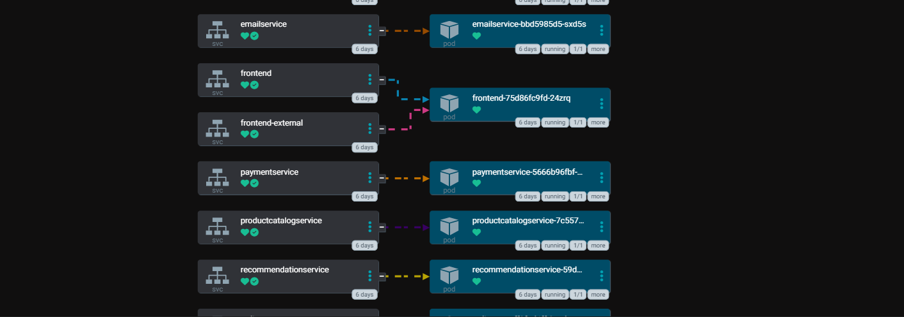
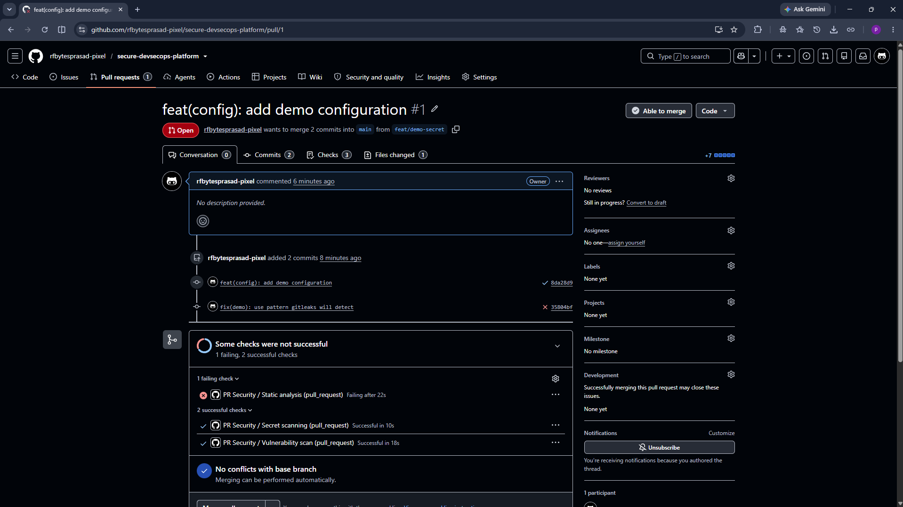
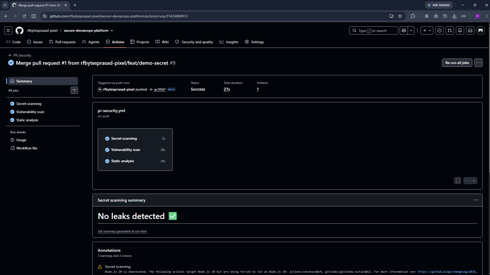

# Secure DevSecOps Platform

A production-grade DevSecOps platform for Kubernetes microservices with security embedded at every stage — from `git commit` to runtime detection.

## Why this exists

Most CI/CD tutorials add security as an afterthought. This project treats security as a first-class citizen — every stage of the pipeline has automated gates, every deploy is signed and verified, every running container is observed.

## Architecture

Developer → GitHub → GitHub Actions CI (SAST + SCA + IaC scan) → Build + Sign + SBOM → Container Registry → ArgoCD → Kubernetes → Policy + Secrets + Runtime monitoring → Prometheus/Grafana/Loki

## Stack

| Layer | Tools |
|---|---|
| Source control | Git, GitHub |
| CI/CD | GitHub Actions, ArgoCD |
| Containers | Docker, BuildKit |
| Kubernetes | kind (local), EKS (cloud) |
| IaC | Terraform, Ansible |
| SAST | Semgrep |
| SCA / SBOM | Trivy, Syft, Grype |
| IaC scan | Checkov |
| Secrets scan | gitleaks |
| Image signing | Cosign |
| Policy as code | Kyverno |
| Secrets mgmt | Vault, External Secrets Operator |
| Runtime security | Falco |
| Observability | Prometheus, Grafana, Loki |

## Progress

- [x] Phase 1 — Sample app on Kubernetes
- [x] Phase 2 — Platform repo structure
- [x] Phase 3 — CI pipeline with security gates
- [x] Phase 4 — GitOps with ArgoCD
- [x] Phase 5 — Secrets management
- [x] Phase 6 — Policy-as-code
- [ ] Phase 7 — Runtime security
- [ ] Phase 8 — Observability
- [ ] Phase 9 — Supply chain security
- [ ] Phase 10 — Threat model + runbooks


## Policy-as-Code (Kyverno)

Admission control blocks non-compliant workloads at the API server.

| Policy | What it blocks |
|---|---|
| `disallow-privileged` | Containers with `securityContext.privileged: true` |
| `require-resource-limits` | Containers without CPU/memory limits |
| `disallow-latest-tag` | Images tagged `:latest` |
| `disallow-hostpath` | `hostPath` volume mounts |

Policies are managed via GitOps (`gitops/policies/`) and enforced in
**Enforce** mode — violating pods are rejected, not just logged.


## Secrets Management

Secrets live in **HashiCorp Vault**. Kubernetes Secrets are created at runtime
by **External Secrets Operator** from `ExternalSecret` declarations.

- **Vault path:** `secret/boutique/*`
- **Sync mechanism:** ESO watches `ExternalSecret` CRDs
- **Rotation:** update in Vault → ESO re-syncs → no Git commit needed
- **In Git:** only the ExternalSecret declaration (which key, from where)
- **Never in Git:** the actual secret value



## GitOps with ArgoCD

The cluster is reconciled from Git continuously. Every commit to
`gitops/apps/boutique/manifests/` is deployed automatically.

- **Application:** `gitops/argocd/boutique-app.yaml`
- **Watched path:** `gitops/apps/boutique/manifests/`
- **Sync policy:** automated, `selfHeal: true`, `prune: true`

Drift detection is enabled — manual changes to the cluster are reverted.

## Security gates in CI

Every PR triggers three independent scans:

| Scanner | Purpose | Blocks on |
|---|---|---|
| **gitleaks** | Detect committed secrets | Any finding |
| **Trivy** | Known CVEs + misconfigurations | CRITICAL |
| **Semgrep** | Static code analysis + secrets | ERROR severity |

Findings scoped to our code are blocking. Third-party code (reference app) is scanned for visibility but excluded from blocking via `.semgrepignore` and `.trivyignore`.

### Evidence

A real PR was blocked on `2026-10-06` — see [`security/incident-log.md`](security/incident-log.md).





## Quick start

```bash
kind create cluster --name devsecops
kubectl create namespace boutique
kubectl apply -f app/release/kubernetes-manifests.yaml -n boutique
kubectl port-forward -n boutique svc/frontend-external 8080:80
